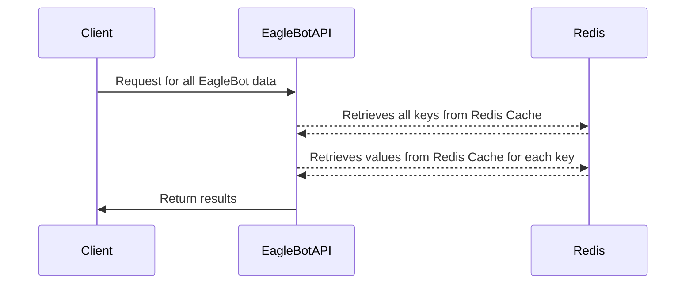
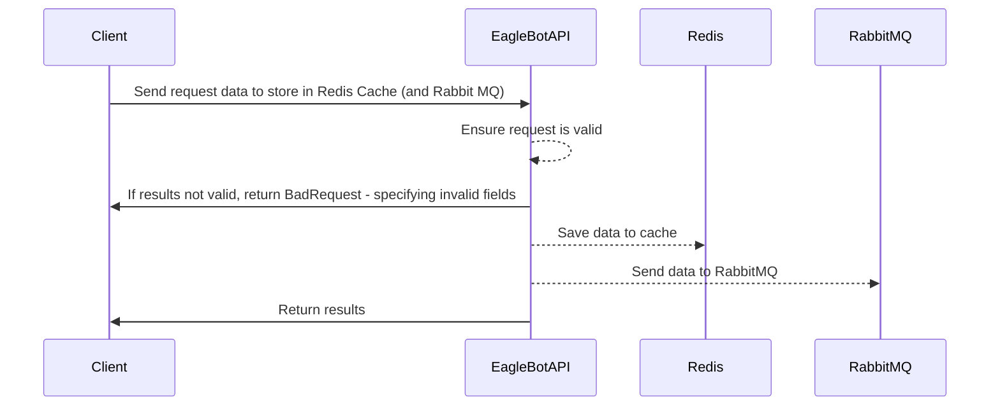

# Transmax - EagleRock/EagleBot API

## First Setup
Ensure you have installed [Docker Desktop](https://www.docker.com/products/docker-desktop/).
Run the following in command prompt (in Administrator mode):
* RabbitMQ (installs RabbitMQ and RabbitMQ Management interface):
	* Pull the RabbitMQ/RabbitMQ Management image:
	`docker pull rabbitmq:3-management`
	* Create and run a new container with the specified image:
	`docker run -d --name eaglebot-rabbit --hostname eaglebot-rabbit -p 15672:15672 -p 5672:5672 rabbitmq:3-management`
* Redis
	* Pull the Redis image:
	`docker pull redis`
	* Create and run a new container with the specified image
	`docker run -d --name eaglebot-redis  --hostname eaglebotredis -p 6379:6379`

## Precheck

Before running the solution, ensure the following:
* The required containers are running (using the Docker Desktop UI):
	* *eaglebot-redis*
	* *eaglebot-rabbit*
	* *Transmax_EagleRock_EagleBot* (this will be created on first run of the solution)
* **If containers are not running, either use the Docker Desktop UI to start them, or use the following in command prompt to start them**:
	* `docker exec -it eaglebot-redis sh`
	* `docker exec -it eaglebot-rabbit sh` 
* Obtain the IP addresses for the redis and rabbit containers, and adjust the appsettings.json/appsettings.Development.json files to match the values:
	* *ConnectionStrings:RedisConnString* (format of "ipaddress:port"):
	`docker inspect -f '{{range.NetworkSettings.Networks}}{{.IPAddress}}{{end}}' eaglebot-redis`
	* *ConnectionStrings:RabbitConnString*:
	`docker inspect -f '{{range.NetworkSettings.Networks}}{{.IPAddress}}{{end}}' eaglebot-rabbit`

## API Flow
### GetActiveEagleBots

### TransferTrafficData

